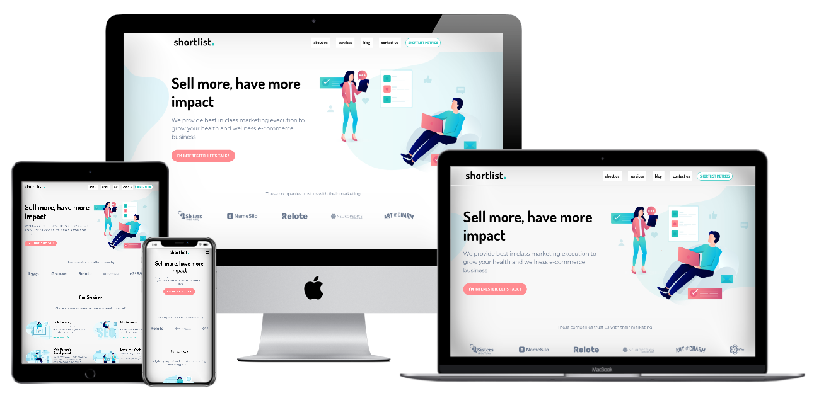

# Cloning a responsive website using HTML and CSS only.

This project is developed as part of my coding bootcamp at Kodigo Code Camp . We are supposed to clone a landing page website and make it responsive using only HTML and CSS. No framework was implemented like Bootstrap, pure HTML and CSS only.

## Live Link

You can see the live demo of the website here:

[(https://cjlacaste28.github.io/shortlist-clone/)](https://cjlacaste28.github.io/shortlist-clone/)

# 

## Technologies

-   HTML
-   CSS

## Author

- [Christian Lacaste](https://christianlacaste.me/)
